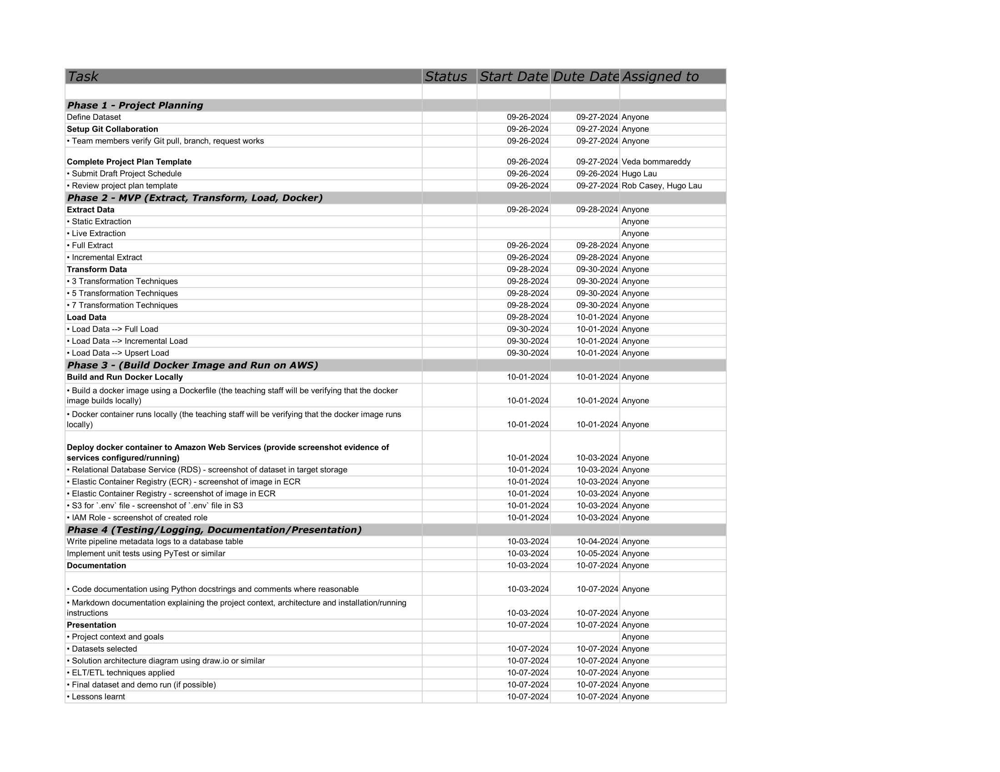

# Project plan

## Objective

The objective of our project is to provide analytical datasets from the Spotify API, focusing on new music releases and their associated audio features. This will facilitate deeper insights into music trends and preferences.

## Consumers

The primary users of our datasets are Data Analysts, Music Industry Professionals, and Marketers. They will access the data through a web interface or a dashboard that allows for easy exploration of trends and features related to new music releases.

## Questions

What questions are you trying to answer with your data? How will your data support your users?

Example:

> - What are the most popular new releases each week?
> - How do audio features (e.g., danceability, energy) correlate with track popularity?
> - What genres are most commonly released in new music?
> - How does the release frequency of artists vary over time?
> - Are there seasonal trends in new music releases?
> - How do the audio features of new releases compare across different artists?

## Source datasets

| Source Name           | Source Type | Source Documentation                       |
|----------------------|-------------|-------------------------------------------|
| Spotify New Releases  | REST API   | [Spotify API Documentation](https://developer.spotify.com/documentation/web-api/) |

The Spotify API updates with new releases daily, so we will schedule data extraction to occur at least once a day to capture all new music.

## Solution architecture

Following is the descriptive solution architecture diagram for implementing ETL on Spotify API

1. Python & Pandas was used for:
    1. Extracting the data about artists, songs, albums, new releases. Pipeline is set to run on a regular schedule
    2. Transforming data -> drop unnecessary columns, rename columns.
    3. Load data to our postgres database.

2. PostgreSQL DBMS was used for storing all our data: artists, songs, ids

3. AWS RDS was used for hosting and managing our postgres database.

4. SQL was used for creating views off of the data that is loaded

5. Docker was used to containerize our pipeline

6. ECR was used to host our docker container

7. ECS was used to run the docker container

8. S3 was used to store the .env file.

#Initial ER Diagram of the database

## Breakdown of tasks

## Phase 1 - Project Planning

| Task                                  | Due Date   | Status   |
|---------------------------------------|------------|----------|
| Define Dataset                        | 09-27-2024 | Complete |
| Setup Git Collaboration               | 09-27-2024 | Complete |
| • Verify Git pull, branch, request    | 09-27-2024 | Complete |
| Complete Project Plan Template        | 09-27-2024 | Complete |
| • Submit Draft Project Schedule       | 09-27-2024 | Complete |
| • Review Project Plan                 | 09-27-2024 | Complete |

## Phase 2 - MVP (Extract, Transform, Load, Docker)

| Task                                  | Due Date   | Status   |
|---------------------------------------|------------|----------|
| Extract Data                          | 09-28-2024 | Complete |
| • Static Extraction                   | 09-28-2024 |          |
| • Live Extraction                     | 09-28-2024 | Complete |
| • Full Extract                        | 09-28-2024 | Complete |
| • Incremental Extract                 | 09-28-2024 | Complete |
| Transform Data                        | 09-30-2024 | Complete |
| • 3 Transformation Techniques         | 09-30-2024 | Complete |
| • 5 Transformation Techniques         | 09-30-2024 | Complete |
| • 7 Transformation Techniques         | 09-30-2024 | Complete |
| Load Data                             | 10-01-2024 | Complete |
| • Full Load                           | 10-01-2024 | Complete |
| • Incremental Load                    | 10-01-2024 | Complete |
| • Upsert Load                         | 10-01-2024 | Complete |

## Phase 3 - Build Docker Image and Run on AWS

| Task                                  | Due Date   | Status   |
|---------------------------------------|------------|----------|
| Build and Run Docker Locally          | 10-01-2024 | Complete |
| • Build Docker image                  | 10-01-2024 | Complete |
| • Run Docker container                | 10-01-2024 | Complete |
| Deploy Docker Container to AWS        | 10-03-2024 | Complete |
| • RDS - screenshot of dataset         | 10-03-2024 | Complete |
| • ECR - screenshot of image           | 10-03-2024 | Complete |
| • S3 - screenshot of 'env' file       | 10-03-2024 | Complete |
| • IAM Role - screenshot               | 10-03-2024 | Complete |

## Phase 4 - Testing/Logging, Documentation/Presentation

| Task                                  | Due Date   | Status   |
|---------------------------------------|------------|----------|
| Write pipeline logs to database       | 10-04-2024 | Complete |
| Implement unit tests                  | 10-05-2024 | Complete |
| Documentation                         | 10-07-2024 | Complete |
| • Python docstrings and comments      | 10-07-2024 | Complete |
| • Project markdown documentation      | 10-07-2024 | Complete |
| Presentation                          | 10-07-2024 |          |
| • Project context and goals           | 10-07-2024 |          |
| • Datasets selected                   | 10-07-2024 |          |
| • Solution architecture diagram       | 10-07-2024 |          |
| • ETL/ELT techniques applied          | 10-07-2024 |          |
| • Final dataset and demo              | 10-07-2024 |          |
| • Lessons learned                     | 10-07-2024 |          |

