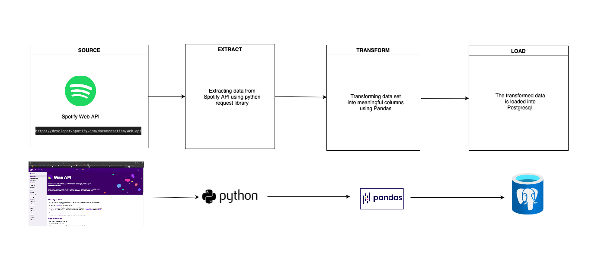
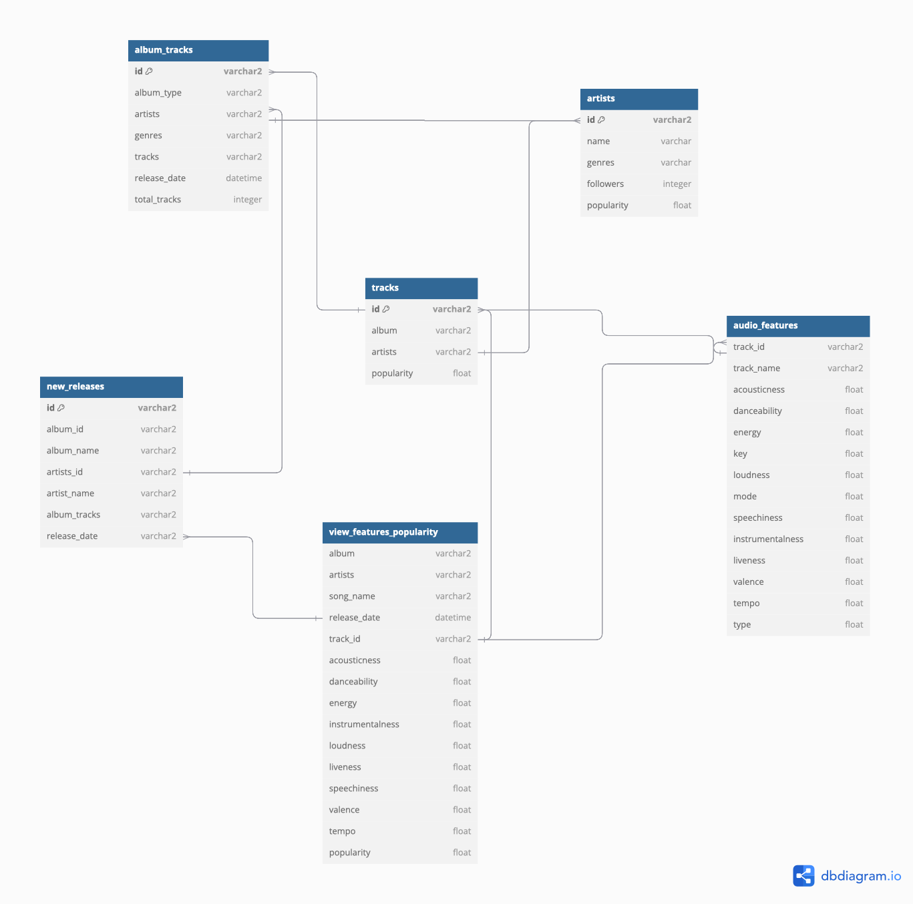
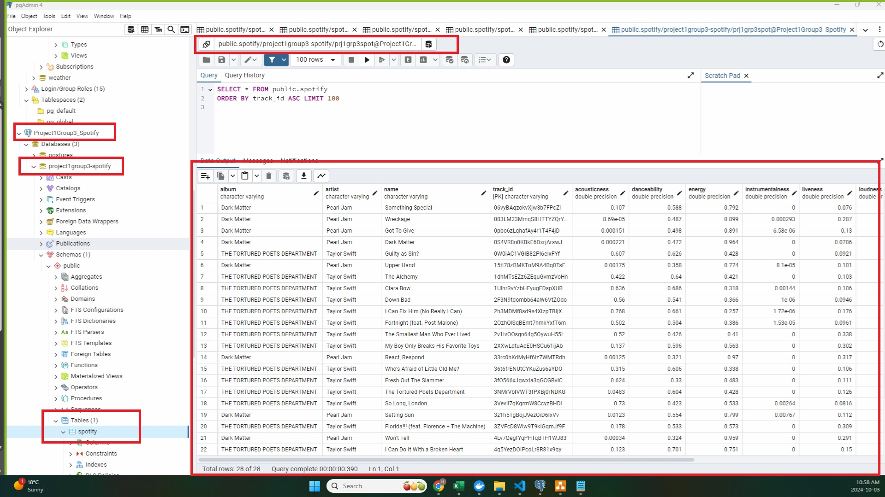
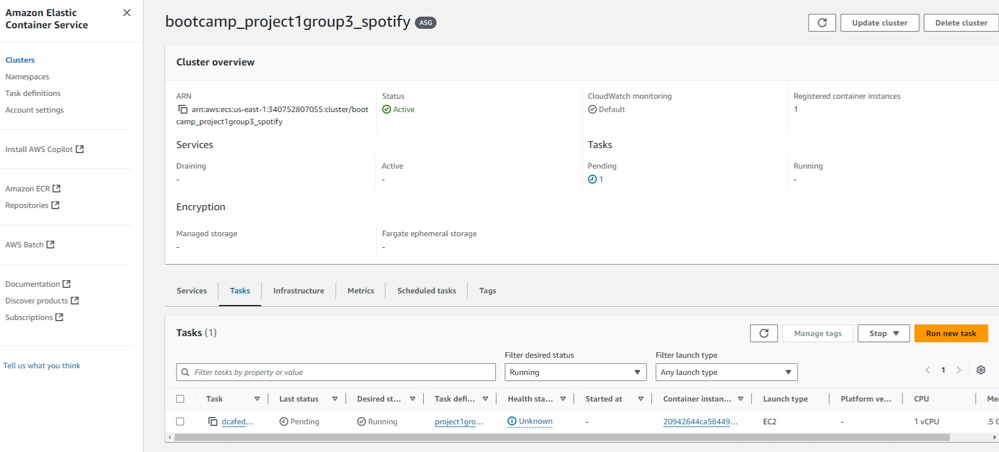
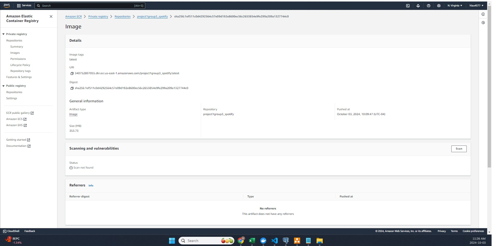
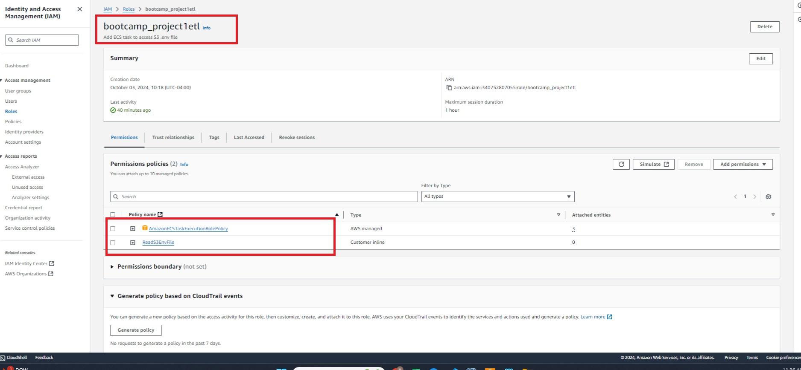
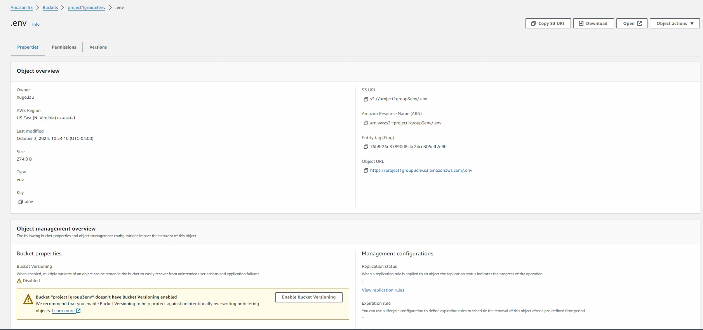

# DEC - Project 1

This project aims to create a pipeline solution that extract from a live dataset that periodically updates, and load it to a relational database, to form an analytical database to help answer questions about music trends. The different containizered ELT packages will be deployed on AWS cloud.

## Objective

The objective of our project is to expore the different ETL pipelines that can provide analytical datasets from the Spotify API. The focus will be on new music releases and their correlation between tracks audio features and popularity, . This will facilitate deeper insights into music trends and preferences.

## Consumers
The primary users of our datasets are Data Analysts, Music Industry Professionals, and Marketers. They will access the data through a web interface or a dashboard that allows for easy exploration of trends and features related to new music releases.

## Questions

What questions are you trying to answer with your data? How will your data support your users?

Example:
> - What are the most popular new releases each week?
> - How do audio features (e.g., danceability, energy) correlate with track popularity?
> - How do the audio features of new releases compare across different artists?

## Source datasets

| Source Name           | Source Type | Source Documentation                       |
|----------------------|-------------|-------------------------------------------|
| Spotify New Releases  | REST API   | [Spotify API Documentation](https://developer.spotify.com/documentation/web-api/) |

The spotify API uses a RESTFUL API. Four API calls were used:
> - Get new releases – identify latest releases
> - Get album tracks – get tracks inside each released album
> - Get track audio features – fetch audio features associated with each track
> - Get track details – get details of track including popularity

## Solution architecture

Following is a high-level solution architecture diagram for implementing ETL on Spotify API.
The solution will deploy two containers, one supporting a python pipeline and another supporting sql.



1. Python, Jinja, Pandas was used for:
    1. Extracting the data about artists, songs, albums, new releases. 
    2. Transforming data -> drop unnecessary columns, rename columns, sorting data.
    3. Load data to our postgres database.

2. PostgreSQL DBMS was used for storing all our data: artists, songs, ids

3. AWS RDS was used for hosting and managing our postgres database.

4. SQL was used to query and create reports off the datasets loaded in PostgresQL. 

5. Docker was used to containerize our pipeline

6. ECR was used to host our docker container

7. ECS was used to run the docker container

8. S3 was used to store the .env file.

## ELT/ELT Techniques Applied
#Initial ER Diagram of the database


To explore and apply the techniques learned in the lessons, two container images were created. 
One was a python pipeline, that did was a full extract and served as our MVP. 
The other was a sql peipeline, which did an incremental extract.

**Extraction**
For both pipelines, the extraction breakdown was as follow:
1. Get new releases - identify the latest albums released and obtain the album id.
2. Get album tracks - from the album id, get the latest tracks and associated track_id inside each release album.
3. Get audio features - from the track_id, get the audio features associated with each track.
4. Get track details - from the track_id, get the track details including popularity.

**Incremental Extraction** 
A notable challenge, was that Spotify did not offer an API endpoint that supported timestamps of the releases on a given date. The API endpoint in particularly only supported an offset to get the X(X=number of determined) previous releases.
We landed on two notable solutions:

1) We did an incremental extraction by comparing the track_ids extracted from the API to list of track_ids that were already loaded into the database. Track_IDs that were not previously loaded to database, the pipeline would proceed to run two additional API calls for each track, to gather the audio features and track details. See attached screenshot for the code to accomplish this

Code in Extraction Function to support incremental extraction
```python 
# Filter to find only new IDs
new_ids = [id_ for id_ in source_ids if id_ not in existing_ids]  # Find new IDs
new_ids = [f"'{id_}'" for id_ in new_ids]  # Quote the string IDs
```
SQL Template
```sql

WHERE
    id IN ({{ new_ids | join(', ') }})  -- Ensure new_ids are properly formatted

```
2) Because the API endpoint, supported an offset to get X = number of latest releases, a timestamp was inserted to prove the incremental extract worked, and didn't simply overlap previous extractions.

3) The nature of data coming from Spotify APi consist of a lot of nested data structures and list of dictionaries. As a result, prior to loading or transforming the data, information had to be extracted from these certain datasets.

Sample code to obtain artist name for this list of dictionaries.
```python
df_track_popularity['album.artists'] = df_track_popularity['album.artists'].apply(lambda x: x[0]['name'] if x else None)
````
**Load**

To delimit data coming from two different pipelines, python and sql pipeline each had their own databases. From SQL pipeline perspective, the python database function as the "source" database for its extraction purposes.

**Transform**
For both pipeline, the tables for audio features and track details were merged. Afterwards, certain columns selected, and re-ordered based on certain criterias such as artist name, song, release date and popularity.
There were more transformative opportunities to provide more data insights especially with SQL Templates.


## Limitations and Lessons Learned
Here are some of the challenges and lessons encountered during the project:
> - **O.Auth2.0** - Spotify APi uses O-Auth2.0 authentication, which involves a two-step process where using client credentials, Spotify authorization server provides an access token which expires in 60 mins. As best practice, the refresh token should be retrieved to avoid exposing clients secret key but due to technical debt, we did not obtain the refresh token. The access token is used for doing the API calls.
> - **Incremental Extraction** - due to the nature of the API endpoint, the offset of latest releases on a periodically updated live dataset, meant we needed to find a way to find a solution for incremental extraction and proved that it work. The later was easily solved by inserting a timestamp. For incremental, finding a column anchor was difficult as release dates and timestamp was not feasible. Ultimately, we had to find a way to compare the track_ids to determined which ones needed to be extracted. 
> - **Data Schema** - the nexted data structure and list of dictionaries meant more exploration and work was required to extract information from data columns. 
> - **API Rate Limit** - related to the extraction, we encountered a few 429 rate limits, due to our pipeline solution. This made incremental extraction important to limit the number of API calls on track information.
> - **Git Branch Conflicts** - about a third through the project, it was learned to push changes from respective branches to avoid merge conflicts but if these scenarios occured, using the rebase line changes, was an effective way to solve conflicts
> - **Python vs SQL Pipelines** In exploring the two pipeline solutions, a few things were discovered
1. Python was the much better choice in doing the extraction and loading, especially in dealing with the data structure of Spotify API. However, due to python transformation being in memory. It's not scalable in doing multiple transformations.
2. SQL was much easier and better for transforming information, allowing us to quickly do queries of key information and transform them accordingly, making multiple transformations at once. However, extractions were a lot more difficult esp with the nature of Spotify data.

## Breakdown of tasks

**Phase 1 - Project Planning**

| Task                                  | Due Date   | Status   |
|---------------------------------------|------------|----------|
| Define Dataset                        | 09-27-2024 | Complete |
| Setup Git Collaboration               | 09-27-2024 | Complete |
| • Verify Git pull, branch, request    | 09-27-2024 | Complete |
| Complete Project Plan Template        | 09-27-2024 | Complete |
| • Submit Draft Project Schedule       | 09-27-2024 | Complete |
| • Review Project Plan                 | 09-27-2024 | Complete |

**Phase 2 - MVP (Extract, Transform, Load, Docker)**

| Task                                  | Due Date   | Status   |
|---------------------------------------|------------|----------|
| Extract Data                          | 09-28-2024 | Complete |
| • Static Extraction                   | 09-28-2024 |          |
| • Live Extraction                     | 09-28-2024 | Complete |
| • Full Extract                        | 09-28-2024 | Complete |
| • Incremental Extract                 | 09-28-2024 | Complete |
| Transform Data                        | 09-30-2024 | Complete |
| • 3 Transformation Techniques         | 09-30-2024 | Complete |
| • 5 Transformation Techniques         | 09-30-2024 | Complete |
| • 7 Transformation Techniques         | 09-30-2024 | Complete |
| Load Data                             | 10-01-2024 | Complete |
| • Full Load                           | 10-01-2024 | Complete |
| • Incremental Load                    | 10-01-2024 | Complete |
| • Upsert Load                         | 10-01-2024 | Complete |

**Phase 3 - Build Docker Image and Run on AWS**

| Task                                  | Due Date   | Status   |
|---------------------------------------|------------|----------|
| Build and Run Docker Locally          | 10-01-2024 | Complete |
| • Build Docker image                  | 10-01-2024 | Complete |
| • Run Docker container                | 10-01-2024 | Complete |
| Deploy Docker Container to AWS        | 10-03-2024 | Complete |
| • RDS - screenshot of dataset         | 10-03-2024 | Complete |
| • ECR - screenshot of image           | 10-03-2024 | Complete |
| • S3 - screenshot of 'env' file       | 10-03-2024 | Complete |
| • IAM Role - screenshot               | 10-03-2024 | Complete |

**Phase 4 - Testing/Logging, Documentation/Presentation**

| Task                                  | Due Date   | Status   |
|---------------------------------------|------------|----------|
| Write pipeline logs to database       | 10-04-2024 | Complete |
| Implement unit tests                  | 10-05-2024 | Complete |
| Documentation                         | 10-07-2024 | Complete |
| • Python docstrings and comments      | 10-07-2024 | Complete |
| • Project markdown documentation      | 10-07-2024 | Complete |
| Presentation                          | 10-07-2024 |          |
| • Project context and goals           | 10-07-2024 |          |
| • Datasets selected                   | 10-07-2024 |          |
| • Solution architecture diagram       | 10-07-2024 |          |
| • ETL/ELT techniques applied          | 10-07-2024 |          |
| • Final dataset and demo              | 10-07-2024 |          |
| • Lessons learned                     | 10-07-2024 |          |


## AWS Screenshots

**Dataset loaded in RDS**



**Scheduled Task in ECS**


**Container Image in ECR**


**IAM Created Role**


S3 Bucket containing env file

